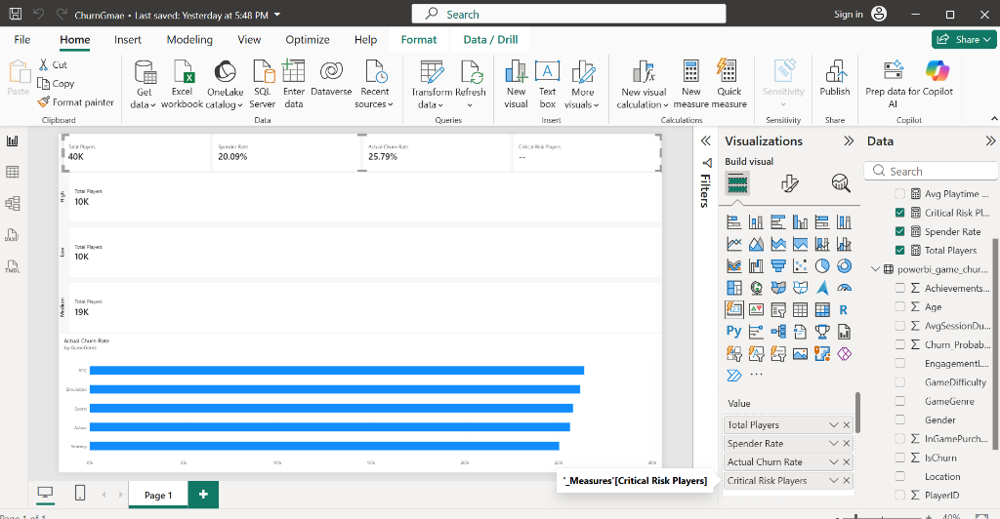
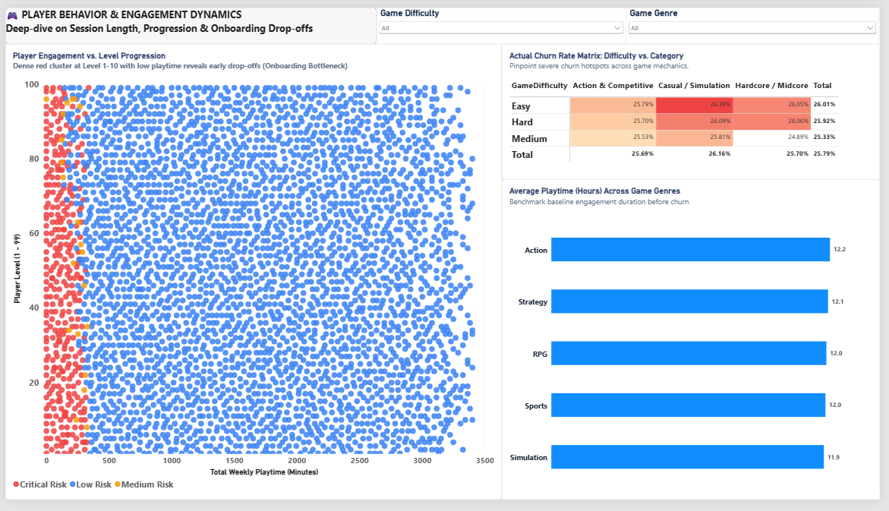
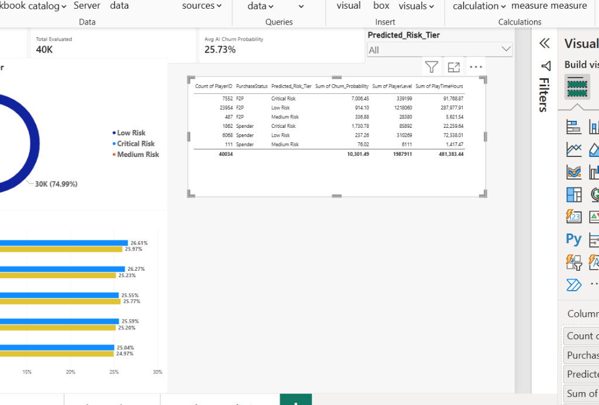

# 🎮 MobileGameChurn: Game Churn Prediction & Player Analytics Pipeline

> **End-to-end Data Science & Machine Learning Pipeline for Mobile Games** — Exploratory Data Analysis (EDA), domain-driven feature engineering, XGBoost modeling (95.45% Accuracy), SHAP explainability, automated unit testing, and deployment.

---

## 📁 Cấu trúc thư mục (Project Structure)

```text
MobileGameChurn/
├── .dockerignore             # Danh sách loại trừ khi build Docker image
├── Dockerfile                # Cấu hình containerization chuẩn Production (non-root, layer caching)
├── docker-compose.yml        # Khởi chạy toàn bộ hệ thống bằng 1 lệnh
├── .streamlit/
│   └── config.toml           # Cấu hình Streamlit theme & production server
├── data/
│   ├── raw/                  # Dữ liệu gốc (online_gaming_behavior_dataset.csv)
│   ├── processed/            # Dữ liệu sau tiền xử lý, scaling & phân chia Train/Test
│   └── game_analytics.db     # SQLite Database phục vụ query phân tích
├── notebooks/
│   ├── 01_EDA.ipynb          # Phân tích khám phá dữ liệu & tương quan hành vi
│   ├── 02_FeatureEngineering.ipynb # Trích xuất đặc trưng & chuẩn hóa dữ liệu
│   └── 03_Modeling.ipynb     # Huấn luyện mô hình, đánh giá & SHAP Explainability
├── test/
│   └── test_modeling.py      # Unit test tự động kiểm tra rò rỉ dữ liệu & hợp đồng mô hình
├── src/
│   ├── data_pipeline.py      # Pipeline tải và làm sạch dữ liệu tự động
│   ├── features.py           # Logic kỹ thuật đặc trưng
│   ├── model.py              # Huấn luyện và lưu trữ mô hình
│   └── api.py                # FastAPI endpoint phục vụ dự đoán Churn
├── reports/                  # Báo cáo, biểu đồ xuất ra
├── dashboard/                # AI LiveOps & Churn Studio (Clean Architecture)
│   ├── app.py                # Main Streamlit router & adaptive theme controller
│   ├── assets/style.css      # Custom CSS Design System (Dark/Light mode)
│   ├── components/           # Reusable UI (KPI cards, Plotly charts, sidebar)
│   ├── services/             # Data caching & Inference engine
│   └── views/                # 4 Core tabs: Executive, Simulator, LiveOps, SHAP
├── models/                   # Lưu trữ checkpoint mô hình (.joblib)
│   ├── best_model.joblib     # Mô hình XGBoost tốt nhất
│   ├── model_features.joblib # Danh sách 20 đặc trưng chuẩn hóa
│   └── scaler.joblib         # StandardScaler artifact
├── requirements.txt          # Danh sách thư viện cần thiết
└── README.md
```

---

## 📊 Bộ dữ liệu (Dataset)
- **Tập dữ liệu:** `online_gaming_behavior_dataset.csv`
- **Quy mô:** 40,034 người chơi
- **Biến mục tiêu:** `EngagementLevel` (`Low`, `Medium`, `High`)
- **Định nghĩa Churn:** Người chơi thuộc nhóm `EngagementLevel == 'Low'` được gán nhãn `IsChurn = 1` (~25.8% tổng tập dữ liệu); các nhóm còn lại là `IsChurn = 0` (74.2%).

---

## 📈 Kết quả Thử nghiệm Mô hình (Model Benchmarking)

Ba thuật toán phân loại được thử nghiệm và so sánh đồng thời trên cùng tập kiểm thử độc lập (Test Set - 20%):

| Mô hình | Accuracy | Precision | Recall (Class 1) | F1-Score | ROC-AUC | PR-AUC |
| :--- | :---: | :---: | :---: | :---: | :---: | :---: |
| **Logistic Regression (Baseline)** | 84.05% | 63.49% | 89.78% | 74.38% | 0.9258 | 0.8498 |
| **Random Forest** | 93.86% | 86.77% | 89.88% | 88.30% | 0.9392 | 0.8828 |
| **XGBoost (Selected)** | **95.45%** | **92.98%** | **89.10%** | **91.00%** | **0.9386** | **0.8895** |

> 🎯 **Business Impact:** Mô hình **XGBoost** vượt trội toàn diện với **Accuracy 95.45%** và **Precision 92.98%**. Đặc biệt với **Recall 89.10%**, cứ 100 người chơi thực sự có nguy cơ bỏ game, mô hình sẽ nhận diện chính xác 89 người, cho phép đội ngũ vận hành can thiệp sớm bằng các chiến dịch khuyến mãi / nhiệm vụ comeback trước khi họ rời bỏ hoàn toàn.

---

## 🔍 Khám phá Nhân tố Churn (SHAP Explainability)

Bóc tách "hộp đen" của mô hình XGBoost bằng **SHAP (SHapley Additive exPlanations)** để hiểu rõ các yếu tố cốt lõi thúc đẩy người chơi rời bỏ game:

1. **`TotalWeeklyMinutes` (TOP 1 Quan trọng nhất):** Tổng số phút chơi mỗi tuần là yếu tố chi phối mạnh nhất. Giá trị thấp (chấm xanh trên biểu đồ Beeswarm) kéo mạnh xác suất Churn sang bên phải (tăng nguy cơ bỏ game).
2. **`PlayerLevel` & `AchievementsUnlocked` (TOP 2 & TOP 3):** Người chơi ở level thấp và chưa mở khóa được nhiều thành tích có tỷ lệ rời bỏ cao hơn hẳn (điểm nghẽn ở giai đoạn tân thủ).
3. **`AchievementsPerLevel` (TOP 4):** Tỷ lệ thành tựu đạt được trên mỗi cấp độ có ảnh hưởng trực tiếp đến độ gắn bó lâu dài của game thủ.

---

## 💡 Nhật ký Tối ưu Đặc trưng (Feature Engineering Refinement Log)

Trong quá trình xây dựng **Notebook 02 (Feature Engineering)**, nhóm phát triển đã rà soát và điều chỉnh công thức tính toán chỉ số tốc độ cày cấp và mở khóa thành tựu để phản ánh đúng thực tế nghiệp vụ game:

### 1. Vấn đề nhận diện (Problem Identified):
- Công thức sơ khởi: `PlayTimeHours / (PlayerLevel + 1)`.
- **Hạn chế:**
  - Ở level cao (ví dụ level 99), mẫu số bị cộng thêm 1 (thành 100) làm suy giảm giá trị thực tế của chỉ số một cách vô nghĩa.
  - Về mặt lý tưởng, do độ khó tăng dần theo cấp (ví dụ: cày từ level 1 → 5 chỉ mất 1 giờ, nhưng từ 5 → 10 mất tới 9 giờ), tốc độ lên cấp chuẩn xác nhất cần tính theo hiệu số thời gian giữa các mốc:  
    $$\Delta t = \text{Thời điểm đạt Level } N - \text{Thời điểm đạt Level } (N - 1)$$

### 2. Đánh giá tính khả thi trên dữ liệu (Data Feasibility Check):
- Kiểm tra tập dữ liệu `online_gaming_behavior_dataset.csv`: Đây là tập dữ liệu **tổng hợp tĩnh cấp người chơi (User-level aggregated snapshot)**, mỗi người chơi chỉ có 1 dòng dữ liệu tóm tắt.
- Dữ liệu hiện tại **không có bảng event timestamp logs** ghi nhận thời gian thực đạt từng level, nên chưa thể trích xuất hiệu số thời gian theo từng mốc level liên tiếp.

### 3. Giải pháp chuẩn hóa (Refined Implementation):
Áp dụng cơ chế phân nhánh điều kiện an toàn, chia trực tiếp cho `PlayerLevel` mà không cộng lệch mẫu số:
- **Nếu `PlayerLevel == 0`:** Mặc định `PlayTimePerLevel = PlayTimeHours` (vì người chơi chưa lên được cấp nào).
- **Nếu `PlayerLevel >= 1`:** Tính trực tiếp $\text{PlayTimePerLevel} = \frac{\text{PlayTimeHours}}{\text{PlayerLevel}}$.
- Tương tự với chỉ số thành tựu: $\text{AchievementsPerLevel} = \frac{\text{AchievementsUnlocked}}{\text{PlayerLevel}}$ (với Level 0 giữ nguyên `AchievementsUnlocked`).

```python
# Cập nhật trong notebooks/02_FeatureEngineering.ipynb
df['PlayTimePerLevel'] = np.where(
    df['PlayerLevel'] == 0, 
    df['PlayTimeHours'], 
    df['PlayTimeHours'] / df['PlayerLevel']
)

df['AchievementsPerLevel'] = np.where(
    df['PlayerLevel'] == 0,
    df['AchievementsUnlocked'],
    df['AchievementsUnlocked'] / df['PlayerLevel']
)
```

> **Kết quả:** Các chỉ số phản ánh trung thực tỷ lệ cày cấp trên toàn bộ dải người chơi (Level 1 đến 99) mà không làm méo mó phân phối đặc trưng trước khi đưa vào mô hình Machine Learning.

---

## 🧪 Kiểm thử Tự động (Automated Testing)

Dự án tích hợp bộ unit test với `pytest` để kiểm soát chất lượng dữ liệu và tính toàn vẹn của mô hình trước khi deploy:
- **`test_no_target_or_id_leakage_in_features`:** Quét toàn bộ ma trận đặc trưng $X$ để đảm bảo 100% không bị rò rỉ cột định danh (`PlayerID`) hoặc biến nhãn mục tiêu (`EngagementLevel`, `EngagementCode`).
- **`test_model_artifact_prediction_contract`:** Kiểm tra mô hình `best_model.joblib` có thể load và xuất ra xác suất hợp lệ trong dải $[0, 1]$.

```bash
# Chạy bộ test:
pytest test/test_modeling.py -v
```

---

---

## 📊 Power BI Executive Dashboard (LiveOps & Business Intelligence)

Dự án phát triển hệ thống Dashboard 3 tầng trên **Power BI Desktop** kết nối trực tiếp với dữ liệu SQLite và kết quả dự báo Machine Learning, phục vụ chiến lược giữ chân người chơi (Retention) cho các Studio Game (case study: Sonat Game):

### 1. Trang 1 — Executive Overview (Báo cáo Cấp Quản lý)
Bức tranh toàn cảnh về sức khỏe tựa game: Tổng số người chơi (40,034), Tỷ lệ Churn thực tế (25.8%), Tỷ lệ người chơi nạp tiền (19.8%) và Phân khúc người chơi (`VIP Spender`, `Loyal Core`, `At-Risk Casual`, `Churned Inactive`).



### 2. Trang 2 — Player Behavior (Phân tích Hành vi & Tương tác)
Đào sâu vào động lực hành vi: Mức độ gắn bó theo từng độ khó game (`Easy`, `Medium`, `Hard`), tương quan giữa thời lượng chơi trung bình và tỷ lệ Churn theo thể loại game (`Action`, `Strategy`, `RPG`, `Sports`, `Simulation`), cùng bộ lọc đa chiều F2P vs Spender.



### 3. Trang 3 — AI Churn Prediction (Dự báo Churn & Kích hoạt LiveOps)
Ứng dụng trực tiếp mô hình Machine Learning: Phân tầng rủi ro người chơi (`Critical Risk: 9,414`, `Medium Risk: 598`, `Low Risk: 30,022`), so sánh xác suất rời bỏ giữa Spender và F2P, cùng **Bảng danh sách can thiệp khẩn cấp (Actionable LiveOps Table)** để đội vận hành xuất danh sách gửi Push Notification / Giftcode giữ chân kịp thời.



---

## ⚙️ Cài đặt & Khởi chạy (Quickstart)

### 1. Khởi tạo môi trường
```bash
# Tạo môi trường ảo
python -m venv .venv

# Kích hoạt (Windows)
.venv\Scripts\activate

# Cài đặt thư viện phụ thuộc
pip install -r requirements.txt
```

### 2. Chạy Pipeline Dữ liệu & Khởi tạo Database
```bash
python src/data_pipeline.py
```

### 3. Chạy Kiểm thử Tự động
```bash
pytest test/ -v
```

### 4. Khởi chạy Streamlit AI LiveOps Studio
```bash
streamlit run dashboard/app.py
```

### 5. Khởi chạy FastAPI Prediction Service
```bash
uvicorn src.api:app --reload --port 8000
```

---

## 🎮 Streamlit AI LiveOps & Churn Intelligence Studio

Ứng dụng web được tái cấu trúc theo mô hình **Clean Architecture** chuyên biệt cho đội ngũ LiveOps & Game Product Managers:
- **Tab 1 — Executive KPIs (Sức khỏe Tựa Game):** Theo dõi 6 chỉ số trọng yếu (Active Players, Actual Churn Rate, Spender Ratio, Avg Playtime, Critical Risk, Revenue at Risk), radar phân tầng rủi ro người chơi và bảng xếp hạng thể loại game có độ giữ chân cao nhất / thấp nhất.
- **Tab 2 — AI Simulator & What-If Sandbox:** Mô phỏng hồ sơ hành vi người chơi để nhận diện rủi ro tức thì qua mô hình XGBoost. Đặc biệt tích hợp **Module Chiến Lược Chuyên Sâu cho Hardcore F2P Grinder** (tư vấn chiến thuật "phá băng ví" qua gói khởi động siêu nhỏ $0.99, vé mùa Battle Pass thay vì dùng Paywall gây ức chế bỏ game).
- **Tab 3 — LiveOps Retention Target Center:** Bộ lọc phân khúc rủi ro và trạng thái nạp tiền, tự động ước tính doanh thu giữ chân ($), đồng thời cho phép xuất dữ liệu `CSV sync` sang hệ thống CRM / Push Notification chỉ với 1 cú click.
- **Tab 4 — Model Explainability (SHAP & Benchmarking):** Bảng so sánh hiệu năng các thuật toán (Logistic Regression, Random Forest, XGBoost) và phân tích TOP 5 đặc trưng quyết định nhất theo lý thuyết trò chơi SHAP.
- **Dual-Theme Engine:** Hỗ trợ chuyển đổi mượt mà giữa chế độ **Dark Gaming Studio (Mặc định)** và **Light SaaS Report** với độ tương phản cao và thiết kế thẻ tinh tế.

---

## 🐳 Containerization & Docker Deployment (Coming Soon / Sẵn sàng Triển khai)

Dự án đã được thiết lập trọn bộ cấu hình Containerization đạt chuẩn **Production MLOps & DevOps**, sẵn sàng đóng gói và triển khai lên AWS ECS, GCP Cloud Run hoặc Kubernetes:

### 1. Đặc điểm kỹ thuật nổi bật
- **Base Image:** `python:3.10-slim` tối giản, đảm bảo nhẹ và tương thích hoàn hảo với C-extensions của XGBoost & LightGBM.
- **Tầng OpenMP & Network:** Tích hợp `libgomp1` cho xử lý đa luồng Machine Learning và `curl` phục vụ giám sát container.
- **Tối ưu Layer Caching:** Tách biệt cài đặt dependencies (`requirements.txt`) và copy mã nguồn giúp re-build thần tốc khi thay đổi logic ứng dụng.
- **Bảo mật Non-root User:** Ứng dụng chạy dưới quyền người dùng an toàn `appuser` (UID/GID `10001`), không sử dụng quyền root.
- **Tự động Giám sát Sức khỏe (Native Healthcheck):** Thăm dò định kỳ endpoint `/_stcore/health` của Streamlit để phát hiện và phục hồi container gặp sự cố.

### 2. Hướng dẫn khởi chạy nhanh bằng Docker Compose (1 lệnh duy nhất)
```bash
# Khởi động container ở chế độ nền ngầm (Detached mode)
docker compose up --build -d

# Theo dõi nhật ký log thời gian thực
docker compose logs -f

# Dừng hệ thống container
docker compose down
```

### 3. Vận hành bằng Docker CLI độc lập
```bash
# Build Docker image
docker build -t mobile-game-churn:latest .

# Khởi chạy container với port 8501
docker run -d -p 8501:8501 --name game_churn_studio mobile-game-churn:latest

# Kiểm tra trạng thái sức khỏe (Health status)
docker ps
docker inspect --format='{{json .State.Health}}' game_churn_studio
```

Truy cập ứng dụng tại: `http://localhost:8501`


